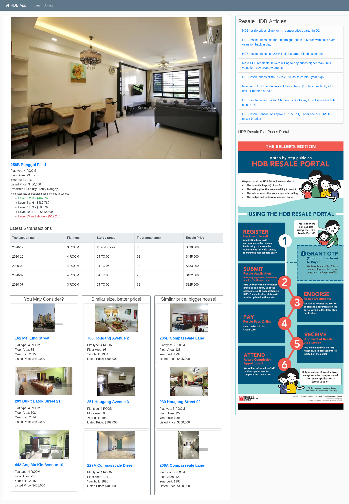

## SECTION 1 : PROJECT TITLE
### HDB Resale Recommender

## SECTION 2 : EXECUTIVE SUMMARY

## SECTION 3 : PROJECT CONTRIBUTION

| Full Name | Student ID | Work Items | Email |
|-----------|------------|------------|-------|
|Yee Wei Liang|A0045422R|Web Scraping, Data Cleaning, Feature Engineering|E0258287@u.nus.edu|
|Toh Kah Khek|A0229968E|Database Setup, Front-end Development, Back-end Integration|E0687376@u.nus.edu|
|Jeon Sungmin|A0133374J|Collaborative Filtering Recommendation System, System Performance & Testing, Video Editing|E0689806@u.nus.edu|
|Ahmed Syalabi Seet|A0229978A|Data Analysis, Data Cleaning, Prediction Tree Modelling|E0687386@u.nus.edu|

## SECTION 4 : VIDEO OF SYSTEM MODELLING & USE CASE DEMO

## SECTION 5 : INSTALLATION AND USER GUIDE
**Installation guide for Ubuntu 20.04**

1. Navigate to folder of your choice and download the github repository

   command: git clone https://github.com/IRS-JSSW/HDBResalePriceRecommender

   
   

2. Install pip3 package

   command: sudo apt-get install python3-pip

   

3. Install virtualenv package

   command: sudo pip3 install virtualenv

   

4. Navigate to HDBResalePriceRecommender and create virtualenv

   command: virtualenv -p python3 venv

   
   

5. Activate virtualenv

   command: source venv/bin/activate (Note: Ensure that you are seeing (venv) in the terminal)

   

6. Install project dependencies from requirements.txt

   command: pip install -r requirements.txt

   | **No** | **Package** | **Version** |
   |----|---------|---------|
   | 1 | flask | 1.1.2 |
   | 2 | flask-wtf | 0.14.3 |
   | 3 | haversine | 2.3.0 |
   | 4 | requests | 2.25.1 |
   | 5 | selenium | 3.141.0 |
   | 6 | sklearn |---------|
   | 7 | sqlalchemy | 1.3.23 |

   

**User guide**
**Part 1 - To start the app**
1. Navigate to HDBResalePriceRecommender and activate virtualenv
   
   command: source venv/bin/activate (Note: Ensure that you are seeing (venv) in the terminal) 
   
   
   

2. Start the flask application on local machine

   command: project run.py

   

3. Open browser (Firefox or Google Chrome) and navigate to URL http://127.0.0.1:5000/home

   

**Part 2 - To get predicted price of HDB Resale Flats**
1. Input valid Propertyguru Resale HDB listing in textbox and click on the Search button

   

2. Results of predicted price and other recommended Propertyguru listings will be generated

   

**Part 3 - To update HDB Resale Transactions Records from Data.gov**

1. Click on “Update” on the navigation bar and click on “Update Data Gov Table”

   

2. Next, select “Yes” in the dropdown menu and click on “Update” button. Selecting “No” will not update the database and redirects back to the homepage

   

**Part 4 - To update Propertyguru listings**

1. Click on “Update” on the navigation bar and click on “Update Propertyguru Table”

   

2. Next, select “Yes” in the dropdown menu and click on “Update” button. Selecting “No” will not update the database and redirects back to the homepage

   

**Part 5 - To update Amenities Table**

1. Click on “Update” on the navigation bar and click on “Update Amenities Tables”

   

2. Next, select “Yes” in the dropdown menu and click on “Update” button. Selecting “No” will not update the database and redirects back to the homepage

   

**Part 6 - To train Regression Model**

1. Click on “Update” on the navigation bar and click on “Update Training Model”

   

2. Next, select “Yes” in the dropdown menu and click on “Train” button. Selecting “No” will not update the regression model and redirects back to the homepage

   

## SECTION 6 : PROJECT REPORT
`<Project Report>` : \Project Report\[Project Report] IRS-PM-2021-01-16-IS03PT-JSSW-HDBResalePredictionAndRecommender.pdf

1. Executive Summary
2. Business Problem Background
    - 2.1   Project Objective
    - 2.2   Market Research
3. Knowledge Modelling
    - 3.1   Knowledge Identification
    - 3.2   Knowledge Specification
    - 3.3   Knowledge Refinement
4. Project Solution
    - 4.1   System Implementation
    - 4.2   System Performance & Validation
5. Project Conclusions
    - Project Conclusion
    - Improvements
6. Appendix 
    - 6.1   Project Proposal
    - 6.2   Mapping of Domain/Technique Group
    - 6.3   Installation and User Guide
    - 6.4   Individual Project Reports
    - 6.5   List of Abbreviations
    - 6.6   References

## SECTION 7 : MISCELLANEOUS
`<Survey Results>` : \Miscellaneous\Survey Results\Importance when purchasing resale flat.csv

`
` : \Miscellaneous\Survey Results\Feature Ranking.csv

- Results of survey (out of 74 responses)

 
    

- Insights derived, which were subsequently used in our recommender system

| Features | 1st Choice | 2nd Choice | 3rd Choice | 4th Choice | 5th Choice | Final Ranking |
|----------|:----------:|:----------:|:----------:|:----------:|:----------:|:-------------:|
|Ease of Access to LRT/MRT Station|42|24|2|3|3|1|
|Age of Flat|26|17|12|7|12|2|
|Distance to Hawker Centre|4|14|27|19|10|3|
|Distance to Mall|0|13|20|31|10|4|
|Distance to City Centre (Orchard)|2|6|13|14|39|5|
